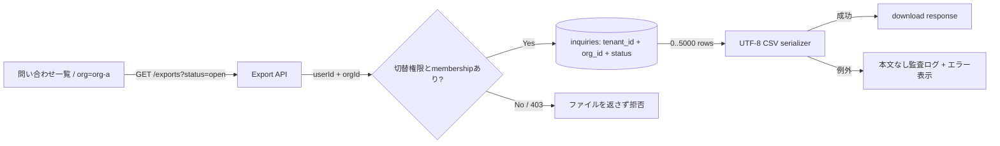

# Change Design Gate

変更作業を、**現物調査 → Issue 確定 → HTML 設計レビュー → ユーザー承認 → 実装**の順に固定する。
このスキルの役割は、実装前に変更の全体像と検証可能な完成条件を揃え、ユーザーが判断できる状態を作ることにある。

repository の agent 規約ファイル（`AGENTS.md`、`CLAUDE.md`）に、設計成果物の保存先、Issue 運用、作業ツリーの規約がある場合はそれを優先する。このスキルはそれらが定めていない部分の既定を与える。

## 変更ゲート

ユーザーが最初から「調査して実装して」「最後まで進めて」と依頼していても、その文言を設計承認として扱わない。
設計 HTML を提示した**後**に、その版を実装してよいという明確な返答を受けるまで実装へ進まない。

承認前に行ってよい作業:

- repository、Issue、仕様、ログ、実環境の read-only 調査
- 原因、影響範囲、既存契約、実装候補の比較
- 既存 Issue の採用、または新規 Issue の一回限りの作成
- Git 管理外の設計ディレクトリ（既定は `work/design-reviews/issue-<番号>/`）への台帳と設計 HTML 作成
- 設計判断に不可欠で、現物から発見できない事項の確認

承認前に行わない作業:

- 作成または採用した Issue の本文、タイトル、comment、state、label、Project field その他の変更
- 作業用 worktree や branch の作成、タスク管理ファイルの更新
- source、test、fixture、migration、IaC、設定、tracked document の編集
- commit、push、PR 作成、deploy、DB write、外部通知
- Red test の作成や「準備だけ」と称した実装コードの変更

既存 Issue が指定されている場合は read-only で採用し、設計資料へ番号、URL、初期 scope、初期受け入れ条件を引き継ぐ。
既存 Issue がない変更依頼では、調査で確定した初期 scope と初期受け入れ条件を本文に含めて一回だけ新規 Issue を作り、その後は read-only とする。
Issue は変更の管理単位と初期 snapshot であり、設計レビューで確定または改訂された詳細 scope、仕様、AC、TC の正本は承認版 HTML とする。
Issue 番号を確定できない場合は設計ファイルを作らず、Issue 連携が未成立であることを報告して停止する。
ユーザー承認後は、repository の標準フローに従って worktree、SDD/TDD、実装、検証、commit、push、Draft PR、独立レビューへ進む。

## 対象と対象外

次の作業は規模にかかわらずこのゲートの対象にする:

- バグ修正、hotfix、回帰修正
- 新機能、既存機能の振る舞い変更
- 振る舞いを変えない refactor
- UI の文言、色、layout、interaction の変更
- API、DB schema、認証、認可、外部 I/O の変更
- 設定、infra、CI/CD、依存関係、運用契約の変更
- 長期仕様、公開仕様、tracked document の変更

次の依頼は変更へ進まない限り対象外にする:

- 説明、状態確認、read-only 調査、review-only
- ユーザーが提供した文章の会話内だけの書き直し
- 個人ローカルの一時メモだけの更新

調査中に修正が必要と判明しても、その場で編集へ移らず、このスキルで設計 HTML を作って承認を待つ。
緊急対応でもゲートは省略せず、資料を短くできても必須項目は残す。

## Phase 1: 現物を調査する

設計は推測で埋めず、変更対象に応じて現在の一次資料を読む。

- ユーザーの直近指示と、明示的に否定された方式
- 関連 Issue、要件、長期仕様、設計ルール
- 現行 source、call site、test、fixture、schema、configuration
- 必要な場合だけ実ログ、read-only API probe、実データ、service state
- manifest と lockfile に記録された利用中 version
- release status、利用中 client、保存済みデータ、deploy 順序、rollback 条件

repository の正本が安定した契約 ID（例: `PIPE-01` のような ID）を定義している領域を変える場合は、影響する契約 ID、外部 API や LLM の呼び出し回数、決定的テストと live 検証・人手評価の境界を設計へ引き継ぐ。

同じ変更で新設または改訂する schema、仕様、test、設計 HTML は、変更案の内部整合を示す資料であって、変更前から存在する契約の一次根拠ではない。
新しい厳格化や fallback を正当化する時は、Issue の目的、リリース済み契約、変更前の利用者向け動作、またはユーザーが明示承認した設計判断のいずれに基づくかを分けて示す。
同じ変更内の資料だけを相互参照して、利用者向けの成功経路を減らす判断を既定化しない。

事実、推定、未確認を混ぜない。
未確認事項が実装方式を大きく変える場合だけユーザーへ確認し、それ以外は推奨案と根拠を資料に書く。

## Phase 2: Issue を確定する

設計ファイルを保存する前に、変更を管理する GitHub Issue を一つ確定する。

- 指定済みの Issue が scope と一致する場合は、その Issue を read-only で採用する
- 指定がない場合は `github-issue-flow` を使い、初期 scope、非 scope、初期受け入れ条件を含む Issue を一回だけ作成する
- Issue 作成結果が返った後は、設計結果を追記する目的でも Issue を編集または comment しない
- Issue 番号、完全な URL、title を一次情報から確認し、推測で補わない
- 一つの設計ディレクトリへ複数 Issue を混在させない

ユーザーがその依頼で Issue 作成を禁止しており、既存 Issue もない場合は、設計ファイルを作らず判断を求める。

## Phase 3: 変更案を設計する

少なくとも次を決める。

1. 解決する問題と、今回扱わない問題
2. 現在の動作と原因または制約
3. 変更後の動作とユーザーから見える差
4. 変更対象の component、file、API、table、job、外部 service
5. data flow、authorization、tenant boundary、transaction、失敗時の動作
6. compatibility、migration、deploy 順序、rollback
7. 採用案、採用しない案、その理由
8. 受け入れ条件と、それを証明するテストケース

原因未特定のまま修正案を断定しない。
複数案で業務上の結果が変わる場合は、推奨案を最初に置いて比較し、設計判断をユーザーへ返す。

### 失敗の影響範囲を先に設計する

validation、parser、schema、候補選定、複数項目の集約、fallback を変える場合は、厳格さや整合性より先に失敗の影響範囲を決める。

- 入力全体、質問グループ、候補、項目、外部 I/O のどれを最小の失敗単位とするかを明記する
- 一つの不正・欠損・timeout が、独立して成功できる兄弟要素へ波及しないことを既定とする
- 波及が必要な場合は、なぜ部分成功を許せないか、変更前後で失われる利用者向け出力、代替案を判断事項へ出し、ユーザー承認まで確定しない
- 「schema と一致する」「構造的に正しい」「fail closed である」だけを全体失敗の理由にしない
- 既存の成功経路、部分成功、fallback、診断の before / after を追い、変更案自身が Issue の目的より広い劣化を持ち込まないことを反証する

複数の質問グループや候補を扱う処理では、少なくとも「一つだけ不正 + 独立した一つは正常」の組み合わせを具体例、受け入れ条件、テストケースへ入れる。
正常な兄弟要素まで破棄する案は、既存の明示契約が要求する場合を除き、実装修正ではなく設計判断として扱う。

## Phase 4: Issue 連携ディレクトリへ保存する

`work/design-reviews/issue-<番号>/`（repository 規約で別の Git 管理外パスが定められていればそれ）を作り、次の二種類を同じディレクトリへ保存する。

- `index.json`: `assets/design-review-index.json` を基にした Issue 連携台帳
- `design-v<N>.html`: `assets/design-review-template.html` を基にした設計資料

`index.json` には Issue 番号と URL、現在版、全体 status、各版の file、作成日時、status、置換元、承認日時を記録する。
新規作成時は `design-v1` / `awaiting_approval` とし、同じ Issue の改訂は上書きせず `design-v<N+1>.html` を追加して旧版を `superseded` にする。
ディレクトリ名、台帳、HTML に書かれた Issue 番号が一致しない状態を許可しない。
HTML は提示時点の不変な設計 snapshot とし、提示後の承認・実装状態で書き換えない。現在の版と進行状態の正本は `index.json` とする。

HTML は次を満たす:

- 単一ファイルで、外部 CDN、外部 font、network access を必要としない
- 日本語で、非エンジニアが最初の要約と図だけでも判断できる
- source path、識別子、契約 ID は根拠確認に必要な範囲で併記する
- desktop と mobile で読め、印刷しても情報が欠けない
- 比較用の通常テキストを `role="img"` で包まない。inline SVG は固有の `<title>` と `<desc>` を持ち、`aria-labelledby` で両方を参照する
- 未記入 placeholder、架空の file path、未確認事実を残さない
- 表示時の script や network access を必須にしない。パイプラインは Mermaid source を HTML 内へ残し、作成時に inline SVG へ render するか、Mermaid と同等の分岐・edge label を持つ inline SVG / HTML として表示する
- 提示時 status を `承認待ち` とし、版、作成日時、Issue 番号、Issue URL、現在状態の正本が `index.json` であることを明記する

### 必須セクション

1. **判断サマリー**: 何を、なぜ、どう変えるか、期待効果、主なリスク
2. **根拠**: 調査した一次資料、確認できた事実、未確認事項
3. **現状と問題**: 再現条件、現行フロー、原因または制約
4. **変更後の仕様**: 利用者・管理者・運用者から見える振る舞い
5. **具体例**: 現実的な入力、前提、通過経路、出力を正常系・境界または否定例・失敗または縮退で示す
6. **変更点一覧**: component / data / API / UI / operations ごとの before / after
7. **影響範囲**: 変更する範囲、変更しない範囲、関連する既存契約
8. **安全性と移行**: authorization、tenant、data、compatibility、deploy、rollback の該当事項
9. **受け入れ条件**
10. **テストケース**
11. **実装計画**: 承認後の順序、紐づく Issue / test / code / docs / PR
12. **判断事項**: 推奨案、代案、未解決事項
13. **承認欄**: status、対象版、承認すると始まる作業、承認しても始まらない外部操作

該当しない安全性項目は削除せず、`該当なし` と理由を書く。
validation、parser、schema、集約、fallback を変える場合は、安全性と移行に「最小の失敗単位」「正常な兄弟要素へ波及するか」「変更前後の fallback 範囲」を必ず記載する。

### 必須の図解

最低 3 つの図を含める。

1. **現状 → 変更後**: 利用者から見える差を左右に比較する
2. **処理パイプライン**: Mermaid `flowchart` または `sequenceDiagram` を優先し、入力から出力、判断分岐、失敗・縮退までを矢印で示す
3. **影響範囲マップ**: 変更する component と、変えない境界を示す

DB、API、非同期 job、deploy の変更では、該当する data flow、sequence、deploy/rollback 図も追加する。
処理パイプラインの node には実在する画面、API、service、DB、job、外部 service 名を書き、edge には主要な request、ID、状態、判断条件を書く。
正常経路だけの一直線にせず、設計に存在する authorization、候補0件、validation error、timeout、retry、縮退のうち該当する分岐を図へ含める。
`入力 → 処理 → 出力`、`処理1 → 判定 → 結果`のような抽象ラベルだけの図は不合格とする。
Mermaid を使う場合は source を `
` 内へ残し、事前に render した SVG を HTML へ inline で埋める。Mermaid CLI が利用できない場合は同じ node、edge、分岐、label を持つ inline SVG / HTML を作り、外部 CDN を追加しない。
装飾目的の図ではなく、文章だけでは見落としやすい境界、順序、責務、データの受け渡しを図にする。

#### パイプライン図の具体例

たとえば問い合わせ CSV 出力なら、次の粒度で書く。

この例の要点は、component 名だけでなく、`org-a`、request、認可条件、query 境界、件数、403、失敗時出力まで読めることにある。

### 具体例

抽象的な仕様を読んだ人が実際の振る舞いを再現できるよう、最低 3 件を `EX-01` から番号付きで示す。

1. **正常系**: 代表的な利用者と入力で、変更後の価値が分かる例
2. **境界または否定例**: 似ているが対象外、権限なし、0 件、上限、別 tenant など、誤適用を防ぐ例
3. **失敗または縮退**: validation error、timeout、外部障害、生成失敗など、利用者向け結果と運用証拠が分かる例

各例には次を含める。

- 現実的だが secret・個人情報を含まない具体的な入力値または操作
- 前提となる user role、tenant、組織、保存済み状態
- パイプライン図のどの node と分岐を通るか
- 画面表示、HTTP status、response、保存結果、ログなど観測可能な出力
- 対応する仕様、AC、TC

複数要素を処理する変更では、失敗例を全件不正だけで済ませず、一つだけ不正で他は正常な混在例にする。
その例では、不正要素の扱いと、正常要素から維持される観測可能な出力を別々に示す。

UI 変更なら操作前後の文言・状態、API 変更なら request / response 例、DB や job なら入力 row・状態遷移・出力 row、LLM を含む応答生成なら利用者入力・route・候補・採用根拠・最終表示を具体化する。
`ユーザーが操作する → 正しく表示される`のように値も分岐もない例は不合格とする。

### 受け入れ条件

受け入れ条件は `AC-01` から番号を付け、次を表にする。

- 前提（Given）
- 操作または事象（When）
- 観測可能な結果（Then）
- 証明方法
- 対応する仕様・契約 ID

正常系だけでなく、現実的な失敗、権限、tenant、境界値、互換性、rollback のうち該当する条件を含める。
複数要素の一部失敗があり得る変更では、不正要素を最小単位で隔離し、独立して正常な要素の出力を維持する条件を含める。
「適切に動く」「問題ない」のように合否を判定できない表現を使わない。

### テストケース

テストケースは `TC-01` から番号を付け、次を表にする。

- 対応する受け入れ条件
- level（unit / integration / contract / E2E / manual / Live）
- 事前条件
- 入力または手順
- 期待結果
- 証拠として残すもの

少なくとも正常系、変更前の不具合を再現する回帰、意味の近い否定例、境界値、失敗時の動作を検討する。
validation、parser、schema、集約、fallback の変更では、「一つだけ不正 + 独立した正常要素」のテストで、失敗が設計した最小単位を越えて波及しないことを assertion する。
該当する場合は authorization / tenant isolation、並行実行、retry / timeout、migration / rollback、accessibility、responsive を含める。
決定的テスト、CI、staging、production、live な外部 API、人手評価を別の証明段階として書き分ける。

## Phase 5: 台帳と HTML を検証して提示する

提示前に次を確認する。

- HTML parser で構文エラーがない
- 必須セクション、3 図、3 件以上の具体例、AC、TC、承認欄が存在する
- パイプライン図に実在 component、主要データ、判断条件、正常経路、該当する失敗・縮退経路がある
- Mermaid source と表示図の node、edge、分岐、label が一致し、表示時に外部 CDN や network access を必要としない
- 各具体例に入力、前提、通過経路、観測可能な出力、対応 AC / TC がある
- AC と TC の対応漏れがない
- validation、parser、schema、集約、fallback の変更では、最小の失敗単位と混在失敗例があり、正常な兄弟要素の出力維持を AC / TC で証明している
- 新しい厳格化や全体 fallback が、同じ変更内で追加した schema、仕様、test だけを根拠に正当化されていない
- `TBD`、`TODO`、placeholder が残っていない
- source path と主張が現物に一致する
- browser で開き、横切れ、重なり、読めない配色がない
- 通常テキストが画像 role で隠されず、各 inline SVG に内容固有の title、desc、aria-labelledby がある
- `index.json` が有効な JSON で、Issue 番号、URL、現在版、status、版履歴が揃い、Issue と版の識別情報が HTML と一致する
- 保存先が Git 管理外であることを `git check-ignore` で確認できる
- 変更ファイルが台帳と設計成果物だけで、実装差分が生じていない

検証後は利用中ツールのファイルプレビューまたは browser で HTML を開き、次の内容を伝えて停止する。

> Issue #<番号> と紐づけて設計 HTML を作成しました。Issue の作成後変更、実装、test、commit、push、PR には進んでいません。内容を確認し、この版で実装してよければ、この設計を承認して実装へ進める旨を明示してください。

承認を促す時は、対象 file、版、主要な判断事項を短く添える。

## Phase 6: 承認を判定する

承認として扱えるのは、HTML 提示後にユーザーが対象の設計を明確に指して `OK`、`承認`、`この設計で実装して`、同等の意思表示をした場合だけにする。
対象版が同じ Issue の `index.json.current_version` と一致し、その版の status が `awaiting_approval` であることも必要とする。
`superseded` の旧版、すでに承認済みの版、別 Issue の版への返答では実装へ進まない。旧版の方針へ戻す場合も、旧 HTML を再承認せず、その内容を引き継いだ新しい current version を作って再提示する。
最初の依頼に含まれる `実装して`、過去の承認、別の設計への承認、曖昧な相槌は使わない。

承認後も次は別承認のまま残る:

- production の状態変更
- deploy、DB write、data migration、secret / traffic 変更
- merge、ready 化、auto-merge
- 設計に含まれない scope 拡大や破壊的判断

ユーザーが変更を求めた場合は同じ Issue ディレクトリへ `design-v<N+1>.html` を作り、`index.json` の現在版と版履歴を更新し、差分を明示して再承認を待つ。
実装中に承認済み設計を変える必要が出た場合も実装を止め、改訂版を作って再承認を得る。
承認を受けたら、`index.json` の全体 status と対象版 status を `approved` にし、`approved_at` を記録する。

## Phase 7: 承認後に実装へ引き継ぐ

承認された版から、次を実装契約として引き継ぐ。

- scope と非 scope
- 採用案と禁止した方式
- AC と TC の ID
- compatibility、migration、deploy、rollback 条件
- 決定的テストと live / 人手確認の境界

Issue 起票時本文の初期 scope / AC を変更の起点として参照し、承認版 HTML の確定 scope / AC / TC を仕様、test name、PR 本文で追跡可能にする。Issue 本文は変更しない。
worktree 作成へ進む時点で `index.json` の全体 status を `implementation_started` にする。
実装完了報告では、承認版からの差分がないこと、AC / TC ごとの結果、未実施の外部確認を示す。

## Phase 8: 一時ディレクトリを片付ける

設計ディレクトリは Git 管理外の一時成果物として、Issue の実装作業が続く間だけ保持する。

- PR merge またはユーザーが作業の破棄を明示するまで、承認済み版と superseded 版を同じ Issue ディレクトリに保持する
- merge 時は、承認版の scope、AC、TC が PR と、その変更に該当する長期仕様、実装、test または検証証拠へ引き継がれていることを確認する。該当しない成果物は理由を確認し、存在を要求しない
- 明示的な破棄時は、当該作業の tracked 変更、worktree、open PR が残っていないことを確認する。存在しない PR、仕様、実装、test への引き継ぎは削除条件にしない
- 条件確認後、対象を完全パスで特定して削除し、削除したことを完了報告へ書く
- pending、承認待ち、実装中のディレクトリや、別 Issue のディレクトリをまとめて削除しない

## 既存スキルとの関係

- Issue の確定は設計前に `github-issue-flow` を使い、その後は既存 Issue の read-only 規約を守る
- 承認後の PR は `independent-final-review` で独立レビューにかける。レビュー指摘への対応が承認済み設計から外れる場合は、このゲートへ戻って次版を作る
- repository が画面設計や品質評価の専用 skill を持つ場合は、このゲートで behavior、data、authorization、AC、TC を合意した後にそれらを使う

## 参考

- `assets/design-review-template.html`: 設計 HTML の雛形（外部依存なし、印刷対応）
- `assets/design-review-index.json`: 台帳の雛形
- `references/examples.md`: 実プロジェクトでの Issue 採用、版更新、承認判定の例
